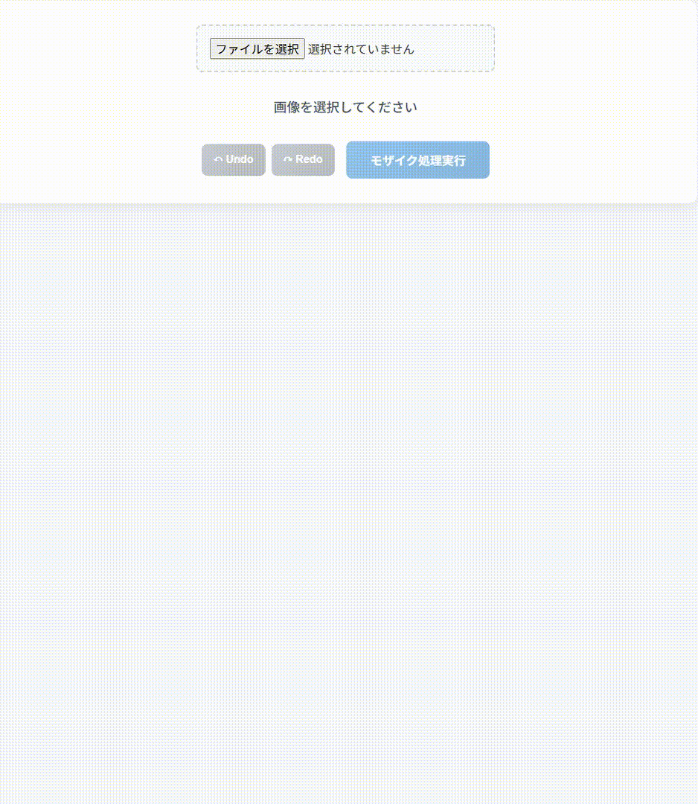

# 画像モザイク処理アプリ

Webブラウザ上で画像にモザイク処理を適用できるアプリケーションです。

## 機能

#### 画像処理
- 画像のアップロード（ドラッグ&ドロップ対応）
- モザイク処理の適用
- 段階的なモザイク処理（既存のモザイクに追加でモザイクを適用可能）

#### 選択機能
- **バウンディングボックス選択**: 矩形範囲を選択
- **フリーハンド選択**: 自由な形状で選択
- **全体選択**: 画像全体にモザイクを適用

#### 履歴管理
- Undo/Redo機能（Ctrl+Z, Ctrl+Y）
- 最大10個の状態を保存
- メモリ使用量の最適化

## 使用方法

#### 基本的な使い方
1. **画像をアップロード**: ファイル選択またはドラッグ&ドロップ
2. **選択モードを選択**: バウンディングボックス、フリーハンド、全体
3. **モザイクの粗さを調整**: スライダーで5px〜50pxの範囲で設定
4. **モザイク処理を実行**: 「モザイク処理実行」ボタンをクリック
5. **結果をダウンロード**: 処理完了後、ダウンロードボタンで保存

#### キーボードショートカット
- `Ctrl + Z`: 元に戻す
- `Ctrl + Y`: やり直し
